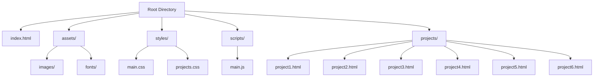
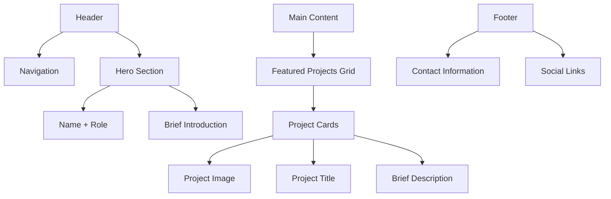
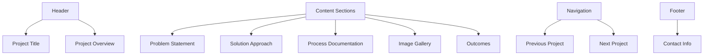

# Portfolio Website Project Plan

## 1. Project Structure


## 2. Technical Stack
- HTML5
- CSS3 (with CSS Custom Properties for theming)
- Vanilla JavaScript (for interactions and animations)
- No external dependencies for faster loading
- Optimized images for performance

## 3. Features and Components

### Homepage (index.html)


### Project Page Template


## 4. Implementation Phases

### Phase 1: Setup and Structure
1. Initialize project directory structure
2. Create base HTML templates
3. Set up CSS architecture
4. Configure GitHub repository

### Phase 2: Core Development
1. Implement responsive layout system
2. Create modular CSS components
3. Develop navigation and interaction patterns
4. Build project page template

### Phase 3: Content and Assets
1. Create placeholder content structure
2. Set up image optimization workflow
3. Implement lazy loading for images
4. Create consistent typography system

### Phase 4: Optimization and Launch
1. Optimize performance
2. Implement SEO best practices
3. Test across devices and browsers
4. Deploy to GitHub Pages

## 5. Key Features
- Responsive design for all devices
- Fast loading times with optimized assets
- Clean typography and whitespace
- Smooth transitions and subtle animations
- Intuitive navigation between projects
- Optimized for accessibility

## 6. File Organization
```mermaid
graph LR
    A[Project Root] --> B[Source Files]
    A --> C[Asset Files]
    A --> D[Documentation]
    B --> E[HTML]
    B --> F[CSS]
    B --> G[JavaScript]
    C --> H[Images]
    C --> I[Fonts]
    D --> J[README.md]